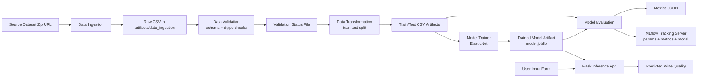
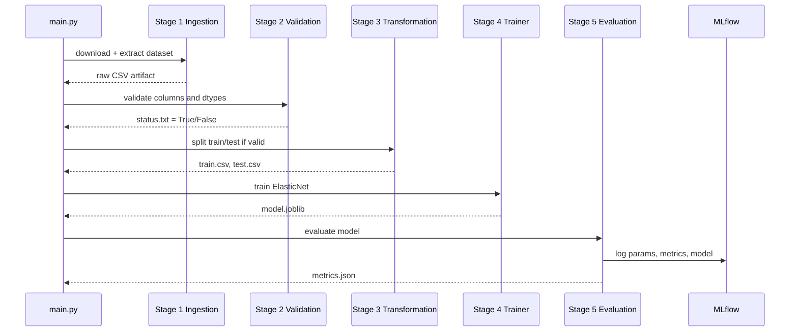

# End-to-End ML Project with MLflow

[](https://www.python.org/)
[](https://scikit-learn.org/stable/)
[](https://mlflow.org/)
[](https://flask.palletsprojects.com/)
[](#project-pipeline)

Production-style machine learning workflow for Red Wine Quality prediction using:

- a multi-stage training pipeline
- artifact-driven MLOps structure
- experiment tracking and model logging with MLflow
- a Flask web app for inference

The project trains an ElasticNet regressor on physicochemical wine features and predicts a quality score.

## Features

- End-to-end modular ML pipeline (ingestion -> validation -> transformation -> training -> evaluation)
- Centralized configuration via YAML (`config.yaml`, `params.yaml`, `schema.yaml`)
- Schema and dtype validation before downstream stages
- Artifact-based workflow under `artifacts/` for reproducibility
- Model persistence using `joblib`
- MLflow tracking for params, metrics, and model logging
- Flask UI for prediction with user-provided feature values
- Structured logging and custom exception handling

## Problem Statement

Given 11 chemical properties of red wine, predict the wine `quality` score.

Input features include:

- fixed acidity
- volatile acidity
- citric acid
- residual sugar
- chlorides
- free sulfur dioxide
- total sulfur dioxide
- density
- pH
- sulphates
- alcohol

## Tech Stack

- Python
- Pandas, NumPy, scikit-learn
- MLflow
- Flask
- PyYAML, joblib

## Project Pipeline

The training run is orchestrated in `main.py` and executes these stages in sequence:

1. **Data Ingestion**
	- Downloads a zip dataset from source URL.
	- Extracts CSV into artifacts.

2. **Data Validation**
	- Checks column presence against schema.
	- Validates no extra columns.
	- Validates data types.
	- Writes validation status to `artifacts/data_validation/status.txt`.

3. **Data Transformation**
	- Performs train/test split (`test_size=0.2`, `random_state=42`).
	- Saves split datasets to artifacts.

4. **Model Trainer**
	- Trains `ElasticNet` using hyperparameters from `params.yaml`.
	- Saves model to `artifacts/model_trainer/model.joblib`.

5. **Model Evaluation + MLflow Logging**
	- Loads test set and trained model.
	- Computes RMSE, MAE, and R2.
	- Saves metrics JSON locally.
	- Logs params and metrics to MLflow.
	- Logs model artifact to MLflow.

## Architecture Diagram



## Pipeline Flow (Stage-to-Stage)



## Portfolio Highlights

- Production-style, multi-stage ML pipeline with clear stage boundaries.
- Traceable artifact lineage from raw data to registered experiment outputs.
- Reproducible training through YAML-driven config and parameter management.
- Integrated model serving path from trained artifact to live Flask prediction UI.

## MLOps Design in This Project

This repository follows practical MLOps patterns:

- **Config-driven pipeline:** data paths, parameters, and schema are not hardcoded.
- **Stage isolation:** each stage has dedicated pipeline and component modules.
- **Artifact lineage:** every stage writes outputs to `artifacts/` for traceability.
- **Observability:** runtime logs are written under `logs/`.
- **Experiment tracking:** MLflow captures params, metrics, and model versions.

## MLflow Setup

Before running model evaluation (stage 5), set these environment variables:

- `MLFLOW_TRACKING_URI`
- `MLFLOW_TRACKING_USERNAME`
- `MLFLOW_TRACKING_PASSWORD`

> Note: This code validates all three variables before evaluation. Even if you use a local MLflow server, you must set all three variables.

### Example (PowerShell)

```powershell
$env:MLFLOW_TRACKING_URI="https://your-mlflow-server"
$env:MLFLOW_TRACKING_USERNAME="your-username"
$env:MLFLOW_TRACKING_PASSWORD="your-password-or-token"
```

### Local MLflow Option

If you want local tracking:

```powershell
mlflow ui --host 127.0.0.1 --port 5000
$env:MLFLOW_TRACKING_URI="http://127.0.0.1:5000"
$env:MLFLOW_TRACKING_USERNAME="local"
$env:MLFLOW_TRACKING_PASSWORD="local"
```

Then run the pipeline in another terminal.

## Project Setup

### 1. Clone the repository

```bash
git clone https://github.com/khalidi-siam/End-to-End-ML-Project-with-MLflow.git
cd End-to-End-ML-Project-with-MLflow
```

### 2. Create and activate virtual environment

```bash
python -m venv .venv
```

Windows PowerShell:

```powershell
.\.venv\Scripts\Activate.ps1
```

Linux/macOS:

```bash
source .venv/bin/activate
```

### 3. Install dependencies

```bash
pip install --upgrade pip
pip install -r requirements.txt
pip install -e .
```

### 4. Configure MLflow environment variables

Set the three variables described above in your current shell before running model evaluation.

## How to Run

### Run complete training pipeline

```bash
python main.py
```

### Run Flask prediction app

```bash
python app.py
```

Open in browser:

`http://127.0.0.1:8000`

## Expected Outputs

After a successful pipeline run, you should see:

- downloaded and extracted dataset under `artifacts/data_ingestion/`
- validation report at `artifacts/data_validation/status.txt`
- train/test CSV at `artifacts/data_transformation/`
- trained model at `artifacts/model_trainer/model.joblib`
- metrics at `artifacts/model_evaluation/metrics.json`
- runtime logs under `logs/`
- experiment runs visible in your MLflow tracking server

## Repository Structure (High Level)

```text
.
|-- app.py                     # Flask inference app
|-- main.py                    # Orchestrates all training stages
|-- config/config.yaml         # Pipeline stage paths and sources
|-- params.yaml                # Model hyperparameters
|-- schema.yaml                # Expected dataset schema
|-- src/mlProject/
|   |-- components/            # Stage implementation logic
|   |-- config/                # Configuration manager
|   |-- entity/                # Dataclass config contracts
|   |-- pipeline/              # Stage entrypoints + prediction pipeline
|   |-- utils/                 # Common helpers + env validators
|   |-- logger.py              # Logging setup
|   \-- exception.py           # Custom exception wrapper
|-- templates/                 # HTML pages for Flask app
|-- research/                  # Jupyter notebooks for experimentation
|-- artifacts/                 # Generated outputs from pipeline stages
\-- logs/                      # Runtime logs
```

## Notes

- Do not commit real credentials or access tokens.
- Keep a local `.env` only for development, and load values into your shell before running stage 5.
- `Dockerfile` is currently empty and can be completed later for containerized deployment.

## Author

Khalidi Siam

